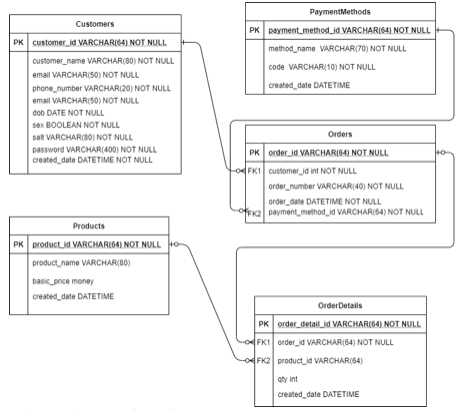

## Logic Test
- Please create business logic for the fibonaci number sequence (0-1000).
- Please create business logic for prima number (0-1000).
- Please create business logic for check is palindrome.

## Database Test

From above ERD please write query
- Display Customer List including calculating the total order.
- Show Product List including calculating the number of orders sorted by the most in the order.
- Display the sort payment method data most frequently used by customers.

### REST Test
From Above ERD please create Rest full API.
- Create register API(Include Generate password).
  - Acceptance
    - Phone number and email is unique.
    - Customer name,email,phone number,dob,sex,created_date is mandatory.
    - Password generated using SHA256 etc mix with salt key(dynamic).

- Create get token api.
  - Acceptance
    - Phone_number_or_email and password is mandatory.
    - Passed validation from (phone_number_or_email ) and password.
    - Must return token with access & refresh type.

- Create refresh token api.
  - Acceptance
    - Must return token with access & refresh type.

- Create order api.
  - Acceptance
    - Passed validation from bearer auth.
    - token is only one use.
    - order number generated with format PO-123/IX/2020 (IX is current month)(2020 is current year),(123 reset per month).
    - order detail can be more than one.
